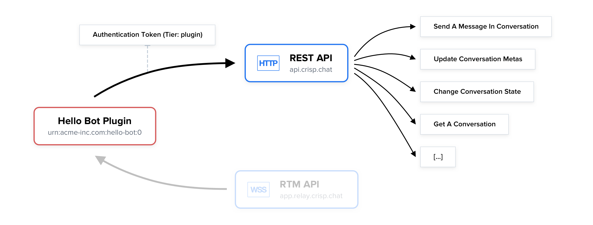

TITLE: Quickstart
INDEX: 1
UPDATED: 2021-09-22

**To retrieve and send data on behalf of Crisp websites, you need to use the REST API. The REST API can be connected to over HTTPS.**

This guide walks you through using the REST API. Note that the REST API can be used aside to the RTM API which lets you receive real-time events associated to any action that you take with the REST API.

# Overview Schematic



_👉 The REST API lets your integration access features that regular Crisp operator users have access to, such as sending messages. Note that the RTM API, not covered in this guide, lets you receive real-time events, and can be used side by side with the REST API._

---

# In-Depth Video Tutorial

${youtube}[In-depth Introduction to the Crisp REST API](4A37k4KAHfo)

---

# How To Use

## Use a library

The most convenient way to use the REST API is to use a REST API-compatible library that we provide.

Let's provide an example on how you can make requests to the REST API in your code.

! As we recommend using JavaScript to build integrations with Crisp, the examples that follow will use the [`node-crisp-api` library](https://github.com/crisp-im/node-crisp-api).

#### 1. Import and configure the library

```javascript
var Crisp = require("crisp-api");

// Create the Crisp client (it lets you access the REST API and RTM API at once)
var CrispClient = new Crisp();

// Configure your Crisp authentication tokens ('plugin' token)
CrispClient.authenticateTier("plugin", "<token_identifier>", "<token_key>");
```

#### 2. Make requests to the API

```javascript
// <previous code eluded>

// Send text message for `website_id` and `session_id`
// Note: replace '<website_id>' and '<session_id>' with your values
CrispClient.website.sendMessageInConversation(
  "<website_id>", "<session_id>",

  {
    type    : "text",
    from    : "operator",
    origin  : "chat",
    content : "This was sent from the REST API!"
  }
)
  .then(() => {
    console.info("Message has been sent.");
  })
  .catch((error) => {
    console.error("Message could not be sent, because:", error);
  });
```

_A full working code example can be found at: [node-crisp-api/examples/send_text_message.js](https://github.com/crisp-im/node-crisp-api/blob/master/examples/send_text_message.js)._

---

## Direct usage (no library)

**In case no library is available, it is still easy to use the REST API using an HTTP library** available for your programming language. As long as you are able to make requests in all available HTTP methods, set body content, and configure request headers, then you are good to go.

**The HTTP endpoint base you will need to use is:** `https://api.crisp.chat/v1/`. Note that all requests must be done via HTTPS (HTTP over TLS), we do not support HTTP (plain text HTTP).

**The full list of HTTP routes available to you**, as well as the data input that they expect, is available on the [REST API Reference](/references/rest-api/v1/).

! The examples that follow **will use cURL over the command-line**, as API users that do not rely on a library are most-likely using the command-line instead.

!! Make sure to replace `{identifier}:{key}` with your token keypair (keep the middle `:` separator). Also, replace `{website_id}` with your website identifier, and any other value with `{brackets}`.

#### Example 1: Get website details

```bash
curl https://api.crisp.chat/v1/website/{website_id} \
  --get \
  --user "{identifier}:{key}" \
  --header "X-Crisp-Tier: plugin"
```

#### Example 2: Send a text message

```bash
curl https://api.crisp.chat/v1/website/{website_id}/conversation/{session_id}/message \
  --user "{identifier}:{key}" \
  --header "Content-Type: application/json" \
  --header "X-Crisp-Tier: plugin" \
  --data '{ "type": "text", "from": "operator", "origin": "chat", "content": "This was sent with cURL!" }'
```

_Note that `--post` does not need to be passed there, as cURL assumes it implicitly if `--data` is being used._

---

# Usage Considerations

## Rate-limits (quotas)

**The REST API is subject to rate-limits and daily quotas** to protect our systems against abuse. It guarantees that the REST API stays as fast and responsive as possible for all Crisp users.

---

## Submitted data

**Whenever you submit data to the API using `POST`, `PUT` or `PATCH`, it gets validated against a data schema.**

The [REST API Reference](/references/rest-api/v1/) specifies the data format that schemas enforce, within the Data Structure section, for each request.

Whenever you submit data to the REST API, if it gets rejected by schema validators, **you will receive the following response error: `invalid_data`**. A message may also be provided, with explanations of what you did wrong.
